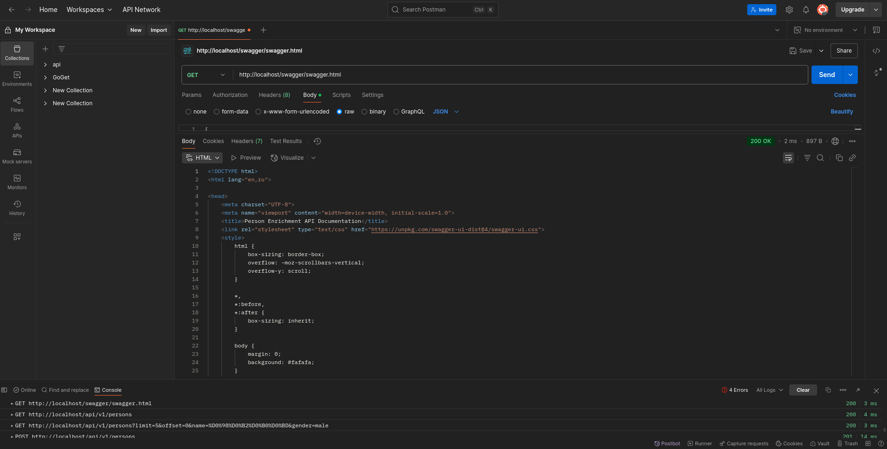
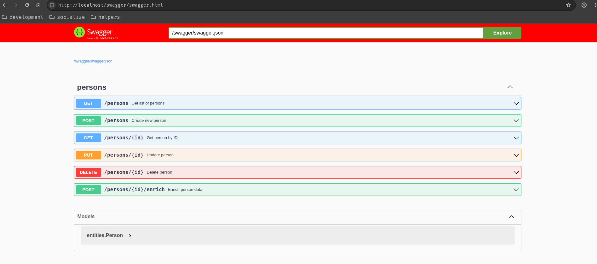
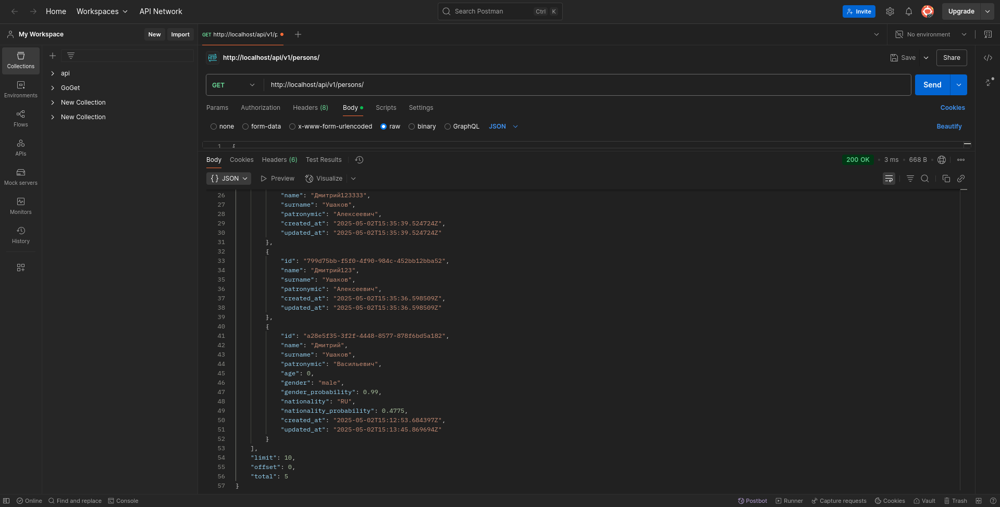
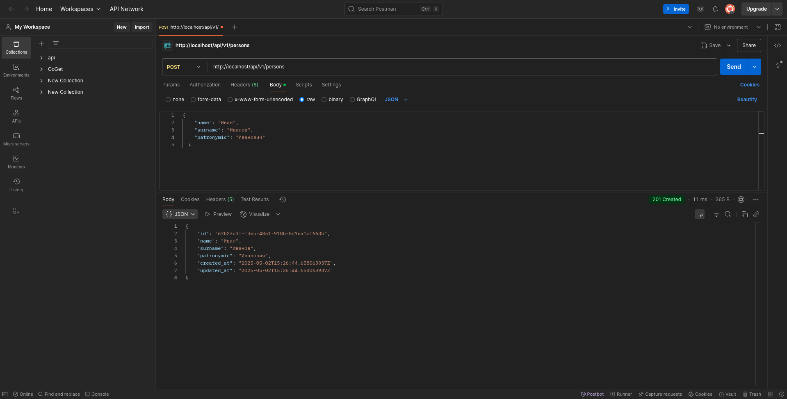
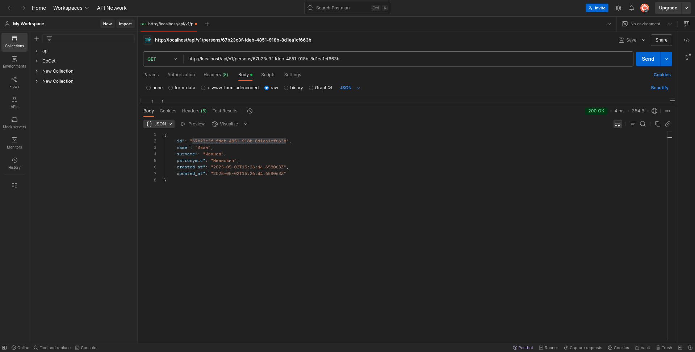
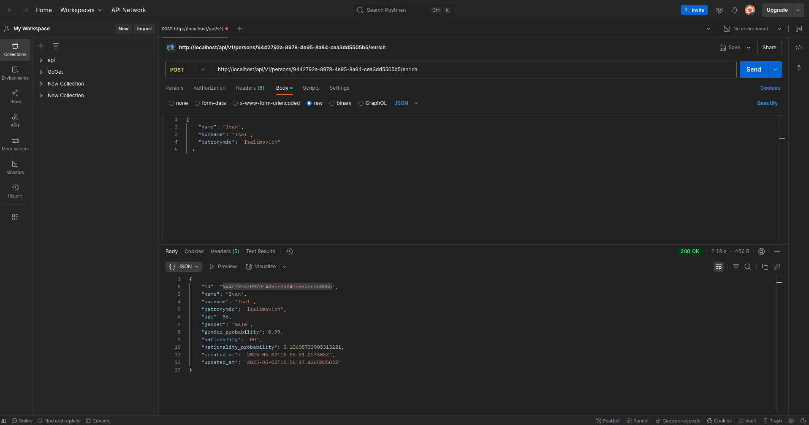
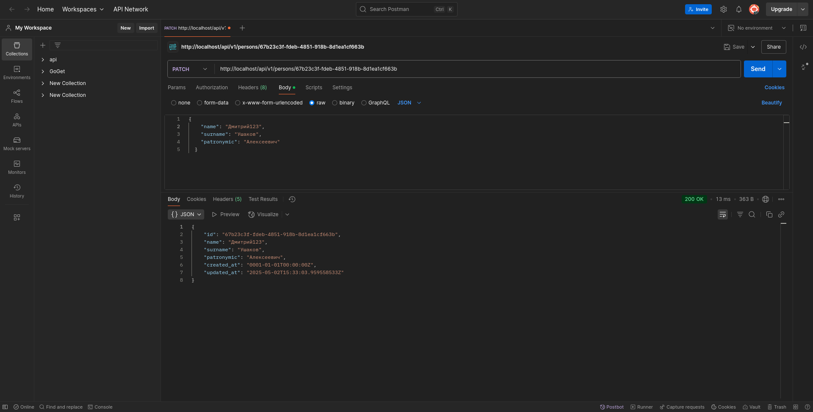
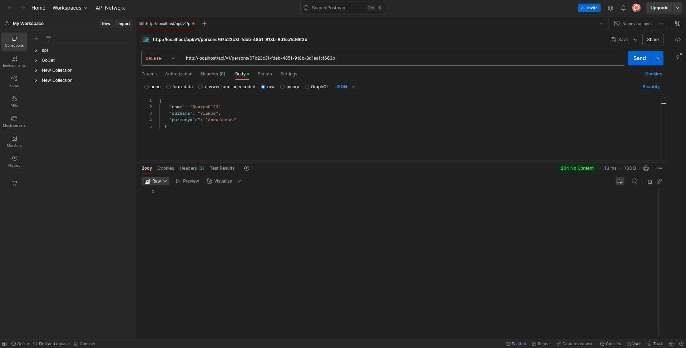

# Сервис обогащения данных о персонах

## Описание

Данный сервис предназначен для хранения и обогащения информации о людях. Он позволяет создавать, получать, обновлять и удалять записи о персонах, а также обогащать их данными о возрасте, поле и национальности с помощью внешних API.

## Технологический стек

- **Go v1.24.2** - современный компилируемый язык программирования
- **Fiber v3.0.0-beta.4** - быстрый HTTP фреймворк, построенный на FastHTTP
- **PostgreSQL** - высокопроизводительная реляционная база данных
- **Zap v1.27.0** - структурированная, производительная библиотека для логирования
- **Docker/Docker Compose v3.8** - для контейнеризации и управления сервисами
- **Swagger** - для автоматизации документирования API
- **UUID v1.6.0** - для генерации уникальных идентификаторов
- **golang-migrate v4.18.3** - инструмент для управления миграциями базы данных
- **Nginx v1.27.5** - высокопроизводительный веб-сервер и прокси

## Архитектура

- **domain** - бизнес-логика и модели данных
- **ports** - интерфейсы для взаимодействия между слоями
- **adapters** - реализации интерфейсов для внешних сервисов и баз данных

## Запуск сервиса

### Установка и запуск с использованием Docker

```bash
git clone https://github.com/flexer2006/case-person-enrichment-go.git
cd case-person-enrichment-go
cp .env.example .env
cd deploy
docker-compose up -d
```

После запуска сервис будет доступен через Nginx по адресу: `http://localhost:80`

## Конфигурация

Основные настройки находятся в файле .env. Пример конфигурации можно найти в .env.example.

### Основные параметры

- **База данных**: настройки подключения к PostgreSQL
- **HTTP-сервер**: параметры для Fiber
- **Nginx**: параметры для проксирования запросов
- **Логирование**: настройки логов

## Документация API

### Swagger UI

Интерактивная документация API доступна по адресу: `http://localhost/swagger/swagger.html`

## Эндпоинты API

### Основной URL: `/api/v1`

| Метод  | Путь                  | Описание                                           |
| ------ | --------------------- | -------------------------------------------------- |
| GET    | `/persons`            | Получение списка персон с фильтрацией и пагинацией |
| GET    | `/persons/:id`        | Получение персоны по ID                            |
| POST   | `/persons`            | Создание новой персоны                             |
| PUT    | `/persons/:id`        | Обновление персоны                                 |
| PATCH  | `/persons/:id`        | Частичное обновление персоны                       |
| DELETE | `/persons/:id`        | Удаление персоны                                   |
| POST   | `/persons/:id/enrich` | Обогащение данных персоны                          |

## Примеры использования API

### 1. Получение списка персон с фильтрацией

```bash
# Получить всех пользователей (первые 10).
curl -X GET "http://localhost/api/v1/persons"

# С применением фильтров.
curl -X GET "http://localhost/api/v1/persons?limit=5&offset=0&name=Иван&gender=male"
```

Пример ответа:
```json
{
  "data": [
    {
      "id": "550e8400-e29b-41d4-a716-446655440000",
      "name": "Иван", 
      "surname": "Иванов",
      "gender": "male",
      "gender_probability": 0.98,
      "nationality": "RU",
      "nationality_probability": 0.86
    }
  ],
  "total": 1,
  "limit": 5,
  "offset": 0
}
```

### 2. Создание новой персоны

```bash
curl -X POST "http://localhost/api/v1/persons" \
  -H "Content-Type: application/json" \
  -d '{
    "name": "Дмитрий",
    "surname": "Ушаков",
    "patronymic": "Васильевич"
  }'
```

### 3. Получение персоны по ID

```bash
curl -X GET "http://localhost/api/v1/persons/550e8400-e29b-41d4-a716-446655440001"
```

### 4. Обогащение данных персоны

```bash
curl -X POST "http://localhost/api/v1/persons/550e8400-e29b-41d4-a716-446655440001/enrich"
```

### 5. Обновление персоны

```bash
curl -X PUT "http://localhost/api/v1/persons/550e8400-e29b-41d4-a716-446655440001" \
  -H "Content-Type: application/json" \
  -d '{
    "name": "Дмитрий",
    "surname": "Ушаков",
    "patronymic": "Алексеевич"
  }'
```

### 6. Удаление персоны

```bash
curl -X DELETE "http://localhost/api/v1/persons/550e8400-e29b-41d4-a716-446655440001"
```

## Внешние API для обогащения данных

Сервис использует следующие внешние API для обогащения данных:

- **Возраст**: [https://api.agify.io](https://api.agify.io) - определяет вероятный возраст по имени
- **Пол**: [https://api.genderize.io](https://api.genderize.io) - определяет вероятный пол по имени
- **Национальность**: [https://api.nationalize.io](https://api.nationalize.io) - определяет вероятную национальность по имени

## Структура базы данных

### Таблица `people`

| Поле | Тип | Описание |
|------|-----|----------|
| `id` | UUID | Первичный ключ, уникальный идентификатор персоны |
| `name` | VARCHAR(100) | Имя персоны (обязательное) |
| `surname` | VARCHAR(100) | Фамилия персоны (обязательное) |
| `patronymic` | VARCHAR(100) | Отчество персоны (необязательное) |
| `age` | INTEGER | Возраст персоны |
| `gender` | VARCHAR(10) | Пол персоны |
| `gender_probability` | DECIMAL(5,4) | Вероятность определения пола |
| `nationality` | VARCHAR(2) | Код страны (национальность) |
| `nationality_probability` | DECIMAL(5,4) | Вероятность определения национальности |
| `created_at` | TIMESTAMP WITH TIME ZONE | Дата и время создания записи |
| `updated_at` | TIMESTAMP WITH TIME ZONE | Дата и время последнего обновления записи |

## Миграции

Сервис автоматически применяет миграции при запуске. Файлы миграций находятся в директории migrations.

## Логирование

Система использует структурированное логирование с помощью библиотеки Zap. Логи содержат информацию о запросах, ошибках и работе сервиса.

## Скриншоты взаимодействия

Swagger:


UI:


`http://localhost/api/v1/persons GET`:


`http://localhost/api/v1/persons?limit=5&offset=0&name=Иван&gender=male`:

ФОТО

`http://localhost/api/v1/persons POST`:


`http://localhost/api/v1/persons/{id} GET`:


`http://localhost/api/v1/persons/550e8400-e29b-41d4-a716-446655440001/enrich POST`:


`http://localhost/api/v1/persons/{id} PUT`:


`http://localhost/api/v1/persons/{id} PATCH`:


`http://localhost/api/v1/persons/{id} DELETE`:
