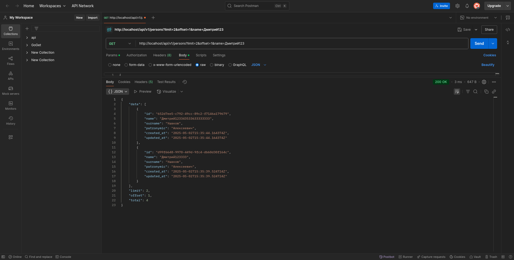

# Person Data Enrichment Service

## Description

This service is designed to store and enrich information about people. It allows creating, retrieving, updating and deleting records about individuals, as well as enriching their data with age, gender, and nationality using external APIs.

## Technology Stack

- **Go v1.24.2** - modern compiled programming language
- **Fiber v3.0.0-beta.4** - fast HTTP framework built on FastHTTP
- **PostgreSQL** - high-performance relational database
- **Zap v1.27.0** - structured, high-performance logging library
- **Docker/Docker Compose v3.8** - for containerization and service management
- **Swagger** - for API documentation automation
- **UUID v1.6.0** - for generating unique identifiers
- **golang-migrate v4.18.3** - tool for database migration management
- **Nginx v1.27.5** - high-performance web server and proxy

## Architecture

- **domain** - business logic and data models
- **ports** - interfaces for interaction between layers
- **adapters** - implementations of interfaces for external services and databases

## Service Launch

### Installation and Launch Using Docker

```bash
git clone https://github.com/flexer2006/case-person-enrichment-go.git
cd case-person-enrichment-go
cp .env.example .env
cd deploy
docker-compose up -d
```

After launch, the service will be available via Nginx at: `http://localhost:80`

## Configuration

The main settings are located in the .env file. A configuration example can be found in .env.example.

### Main Parameters

- **Database**: PostgreSQL connection settings
- **HTTP Server**: Fiber parameters
- **Nginx**: request proxying parameters
- **Logging**: log settings

## API Documentation

### Swagger UI

Interactive API documentation is available at: `http://localhost/swagger/swagger.html`

## API Endpoints

### Base URL: `/api/v1`

| Method | Path                  | Description                                      |
| ------ | --------------------- | ------------------------------------------------ |
| GET    | `/persons`            | Get list of persons with filtering and pagination |
| GET    | `/persons/:id`        | Get person by ID                                 |
| POST   | `/persons`            | Create a new person                              |
| PUT    | `/persons/:id`        | Update a person                                  |
| PATCH  | `/persons/:id`        | Partially update a person                        |
| DELETE | `/persons/:id`        | Delete a person                                  |
| POST   | `/persons/:id/enrich` | Enrich person data                               |

## API Usage Examples

### 1. Getting a List of Persons with Filtering

```bash
# Get all users (first 10).
curl -X GET "http://localhost/api/v1/persons"

# With filters applied.
curl -X GET "http://localhost/api/v1/persons?limit=5&offset=0&name=Ivan&gender=male"
```

Example response:
```json
{
  "data": [
    {
      "id": "550e8400-e29b-41d4-a716-446655440000",
      "name": "Ivan", 
      "surname": "Ivanov",
      "gender": "male",
      "gender_probability": 0.98,
      "nationality": "RU",
      "nationality_probability": 0.86
    }
  ],
  "total": 1,
  "limit": 5,
  "offset": 0
}
```

### 2. Creating a New Person

```bash
curl -X POST "http://localhost/api/v1/persons" \
  -H "Content-Type: application/json" \
  -d '{
    "name": "Dmitry",
    "surname": "Ushakov",
    "patronymic": "Vasilievich"
  }'
```

### 3. Getting a Person by ID

```bash
curl -X GET "http://localhost/api/v1/persons/550e8400-e29b-41d4-a716-446655440001"
```

### 4. Enriching Person Data

```bash
curl -X POST "http://localhost/api/v1/persons/550e8400-e29b-41d4-a716-446655440001/enrich"
```

### 5. Updating a Person

```bash
curl -X PUT "http://localhost/api/v1/persons/550e8400-e29b-41d4-a716-446655440001" \
  -H "Content-Type: application/json" \
  -d '{
    "name": "Dmitry",
    "surname": "Ushakov",
    "patronymic": "Alexeevich"
  }'
```

### 6. Deleting a Person

```bash
curl -X DELETE "http://localhost/api/v1/persons/550e8400-e29b-41d4-a716-446655440001"
```

## External APIs for Data Enrichment

The service uses the following external APIs to enrich data:

- **Age**: [https://api.agify.io](https://api.agify.io) - determines the probable age by name
- **Gender**: [https://api.genderize.io](https://api.genderize.io) - determines the probable gender by name
- **Nationality**: [https://api.nationalize.io](https://api.nationalize.io) - determines the probable nationality by name

## Database Structure

### Table `people`

| Field | Type | Description |
|------|-----|----------|
| `id` | UUID | Primary key, unique person identifier |
| `name` | VARCHAR(100) | Person's first name (required) |
| `surname` | VARCHAR(100) | Person's last name (required) |
| `patronymic` | VARCHAR(100) | Person's patronymic (optional) |
| `age` | INTEGER | Person's age |
| `gender` | VARCHAR(10) | Person's gender |
| `gender_probability` | DECIMAL(5,4) | Gender determination probability |
| `nationality` | VARCHAR(2) | Country code (nationality) |
| `nationality_probability` | DECIMAL(5,4) | Nationality determination probability |
| `created_at` | TIMESTAMP WITH TIME ZONE | Record creation date and time |
| `updated_at` | TIMESTAMP WITH TIME ZONE | Record last update date and time |

## Migrations

The service automatically applies migrations at startup. Migration files are located in the migrations directory.

## Logging

The system uses structured logging with the Zap library. Logs contain information about requests, errors, and service operation.

## Interaction Screenshots

Swagger:


UI:


`http://localhost/api/v1/persons GET`:


`http://localhost/api/v1/persons?limit=2&offset=0&name=Dmitry123`:


`http://localhost/api/v1/persons POST`:


`http://localhost/api/v1/persons/{id} GET`:


`http://localhost/api/v1/persons/550e8400-e29b-41d4-a716-446655440001/enrich POST`:


`http://localhost/api/v1/persons/{id} PUT`:


`http://localhost/api/v1/persons/{id} PATCH`:


`http://localhost/api/v1/persons/{id} DELETE`:
